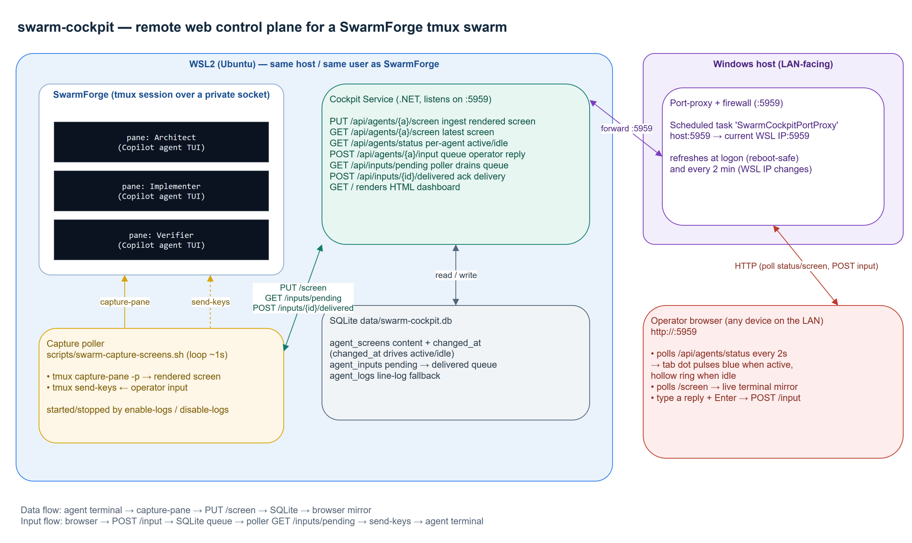

# swarm-cockpit

Sidecar web cockpit for SwarmForge.

swarm-cockpit gives you a browser view of a running SwarmForge agent swarm and
lets you drive it remotely. A small poller mirrors each agent's live tmux
terminal into a web dashboard, flags which agents are actively working, and
sends your typed replies straight back into the right agent's terminal — so you
can watch and answer the swarm from any device on your network.



**How it works:** SwarmForge runs the agents in tmux. The capture poller
(`swarm-capture-screens.sh`) reads each pane with `tmux capture-pane` and pushes
the rendered screen to the .NET cockpit service, which stores it in SQLite and
renders the dashboard. Your browser polls the service for each agent's screen
and activity status; anything you type is queued in the service and delivered
back into the agent's pane with `tmux send-keys`. On WSL2, a Windows port-proxy
exposes the service to the rest of your LAN. See
[docs/architecture.drawio](docs/architecture.drawio) for the editable source.

## Quick Start (WSL/bash)

```bash
bash ./swarm-cockpit start
```

The service listens on all network interfaces at fixed port 5959.
From another machine on the same network, open:

```text
http://<host-ip>:5959
```

In another shell, start SwarmForge normally:

```bash
./swarm
```

Mirror each agent's live terminal screen from tmux into the cockpit:

```bash
bash ./swarm-cockpit enable-logs
```

This polls `tmux capture-pane` and shows the agent's actual rendered screen in the
web page (what you'd see in the terminal), instead of raw redraw bytes.

### Reply to an agent from the browser

Each agent panel has an input box. Type a reply and press Enter (or click Send) and
the text is delivered straight into that agent's tmux pane via `tmux send-keys` — so
you can answer the questions you see on the mirrored screen from any device on the
network, no agent cooperation required. Input is queued in the cockpit and delivered
by the same poller that mirrors the screen (within ~1s).

Disable screen mirroring:

```bash
bash ./swarm-cockpit disable-logs
```

## Access from another machine (WSL2)

If SwarmForge and the cockpit run inside **WSL2**, binding port 5959 there is not
enough: WSL2 sits behind a NAT, so other machines on your LAN cannot reach it, and
the WSL IP changes on every WSL restart. (Windows 11 "mirrored" networking would
avoid this, but it silently falls back to NAT on many corporate machines.)

The fix is a Windows port-proxy that forwards `host:5959 -> currentWslIp:5959`,
kept up to date automatically. Run this **once** from an elevated (Administrator)
PowerShell on the Windows host:

```powershell
powershell -ExecutionPolicy Bypass -File scripts\windows\install-cockpit-portproxy.ps1
```

This:

- adds the inbound firewall rule for TCP 5959,
- forwards the host's LAN interface to the current WSL IP, and
- registers a scheduled task (`SwarmCockpitPortProxy`) that re-points the proxy at
  logon (survives reboots) and every 2 minutes (catches WSL IP changes).

`bash ./swarm-cockpit start` also triggers that task on startup, so the proxy is
refreshed the moment the service comes up. From another machine, browse to
`http://<windows-host-LAN-ip>:5959`.

Manual one-off refresh (no scheduled task needed):

```powershell
powershell -ExecutionPolicy Bypass -File scripts\windows\update-cockpit-portproxy.ps1
```

To remove the automation: `Unregister-ScheduledTask -TaskName SwarmCockpitPortProxy -Confirm:$false`

## Notes

- Keep SwarmForge launch/config unchanged.
- No Copilot plugin/hook required.
- Allow inbound TCP 5959 on the host firewall if remote machines cannot connect.
- Running natively on Linux (not WSL2)? None of the port-proxy setup is needed —
  just open TCP 5959 on the host firewall.
